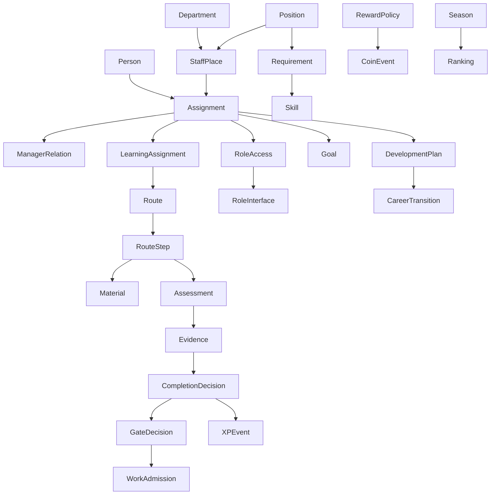

# USTAR — Architecture Studio vs Constitution B001–B109

Статус: **черновик для решения владельца; CURRENT ≠ TARGET**.

## 1. Итог сравнения

Architecture Studio сохранил полезные продуктовые намерения, но не является полным представлением Конституции. Все 30 верхнеуровневых решений помечены resolved, хотя несколько формулировок содержат «нужно определиться», четыре object override остаются undecided, Final Review не подтверждён. Конституционные правила в generated TARGET не трассируются.

Правило приоритета для следующей фазы:

1. Утверждённая Конституция B001–B109 задаёт обязательные бизнес-инварианты.
2. Явное позднее решение владельца может уточнить Конституцию только через версионируемое изменение Конституции.
3. Architecture Studio задаёт design intent, но не отменяет Конституцию молча.
4. Production/current-state является evidence реализации, но не business truth.

## 2. Полное покрытие правил

| Rules | Область | Studio CURRENT decision | Coverage | Главный gap / конфликт |
|---|---|---|---|---|
| B001–B003 | Человек, учётная запись, создание | `person`, `account-type`, `lifecycle` | Частично | Self-registration + игры до HRD approval не согласованы с назначением сотрудника на штатное место и контролем доступа |
| B004–B010 | Карьера, уровни, следующая должность | `career`, `position`, `requirements` | Частично | Решение career формально resolved, но текст «нужно определиться»; нет модели перехода и истории |
| B011 | Руководитель/подчинение | `management` | Не реализовано | reporting=0; owner/manager chain отсутствует |
| B012–B020 | Навыки, уровни, KPI, development | `skill`, `skill-level`, `requirements`, `hr` | Частично | KPI и индивидуальный development plan не являются first-class entities |
| B021–B024 | Материалы, владелец, актуальность, версии | `materials` | Частично | owner/sourceOfTruth пусты; нет обязательного review lifecycle |
| B025–B031 | Курсы, активности, completion | `courses=REMOVE`, `activities`, `completion` | Конфликт | Удаление courses допустимо только из пользовательского языка; Moodle course остаётся техническим контейнером. Кнопка «завершить» недостаточна для risk evidence |
| B032–B038 | Route, steps, gates, admission | `route`, `route-step`, `gate`, `evidence` | Частично | Есть 3 routes; gate после теста слишком универсален; нет полного admission lifecycle |
| B039–B046 | Адаптация, доказательства, проверки | `checklists`, `completion`, `evidence`, `hr` | Частично/конфликт | Универсальный multiple-choice противоречит доказательству, соответствующему риску/практике |
| B047–B057 | XP, USCOIN, store, seasons | `games`, `economy`, `boards` | Конфликт | Studio предлагает XP→USCOIN; current leaderboard не имеет честного season/group scope; экономики смешаны |
| B058–B068 | Наставник, feedback, review/history | `hr`, `checklists`, `reporting` | Недостаточно | Mentor не first-class; reporting empty; нет полной неизменяемой истории решений |
| B069–B077 | Goals и progress | `hr`, `reporting`, `lifecycle` | Частично | Goals представлены 2 строками current; ownership, cadence и linkage не определены |
| B078–B085 | Competition, league, ranking fairness | `games`, `economy`, `boards` | Конфликт | Isolated: 90 participants, 89 others disclosed, 87 tied people split into distinct ranks, same-position team fallback, global rank in team card; competition/season/league tables=0 |
| B086–B091 | Notifications и tasks | Только текст внутри `checklists`/`reporting` | Не смоделировано | Нет сущностей Notification, Task, Escalation, channel policy, delivery/ack state |
| B092–B095 | Role dashboards | `role-ui` | Не сгенерировано | TARGET model `roles: 0`; role journey и interface contract отсутствуют |
| B096–B101 | Org, staff place, vacancy, assignment | `organization`, `department`, `position`, `management` | Частично/конфликт | Список людей подменяет оргмодель; нет staff place/vacancy/temp assignment/versioned structure |
| B102–B103 | Access и lifecycle | `access-profile`, `account-type`, `lifecycle` | Конфликт | HR-доступ наследуется от отдела; 82 аккаунта получают employee default; least privilege не доказан |
| B104–B106 | Library/reporting/integrations | `materials`, `reporting` | Частично | Нет канонической библиотеки, reporting chain и управляемого integration inventory |
| B107–B109 | Governance, source of truth, consistency | `final` | Не выполнено | owner/sourceOfTruth пусты; B-traceability отсутствует; Final Review не подтверждён |

Таблица покрывает каждый ID B001–B109 ровно в своей непрерывной группе; детальная реализация должна хранить ссылки на отдельные правила, а не только диапазоны.

### Сводная цепочка «идея → Studio → Конституция → реализация»

| Блок | Эталон | Сейчас | Разница | Что делать |
|---|---|---|---|---|
| Роли и доступ | B092–B103: ответственность, lifecycle и role dashboards | 15 Moodle roles, 2622 capability rows; Studio output `roles: 0`; HR/HRD смешаны | Техническая роль подменяет business/access model | Ввести Role Interface Contract и раздельные Access Profiles; провести negative role tests |
| Организация | B096–B101: org, staff place, vacancy, assignment | 16 departments, 52 declared positions, 33 used position codes; reporting=0 | Нет staff place, versioned assignment и manager relation | Выбрать canonical HR source и мигрировать в версионируемую модель |
| Маршруты | B025–B046: learning assignment, route, evidence, gate | 3 USTAR routes + 28 Moodle enrol instances; legacy fallback | Две параллельные модели назначения/прогресса | Утвердить business assignment и technical Moodle projection |
| Материалы | B021–B024, B104: owner, version, review, library | 66 content, 58 versions, 1 acknowledgement; owner/SoT в TARGET пусты | Техническое versioning есть, governance неполный | Назначить owner/SoT/review cycle и migration mapping |
| Навыки/KPI | B012–B020 | 23 skills в structure; skill matrix; KPI entity отсутствует | Completion/course progress используется как proxy skill | Ввести evidence-based skill result и отдельный KPI lifecycle |
| Игры | B047–B048, B054–B057 | 2 games, 32 attempts, 8 mastery | Игра реализована как quiz-like mechanism; season/fairness неполны | Привязать game mechanics к утверждённым rules и abuse tests |
| USCOIN | B049–B053 | Isolated snapshot: 8 ledger rows, idempotency race PASS; 2 dry-run awards pending; no store/reversal; overspend accepted; manual actor null | Mastery и экономическая награда смешиваются; ledger нельзя считать безопасным purchase model | Утвердить economy policy; atomic debit, reversal chain, operator audit, limits and store lifecycle only after owner decision |
| Leaderboard | B054–B057, B074–B085 | 90 global participants; 89 other identities/29 positions/coin fields exposed; 87 tied people get distinct ranks; `reporting=0`; calendar month, no season tables | Separate competition points, privacy, comparable group, tie, team size/newcomer/transfer, immutable close/history not implemented | Approve Competition/Season/RuleVersion/Audience/ScoreEvent/Result/Reward model, then fairness and privacy acceptance tests |
| Tasks/notifications | B086–B091 | Есть тексты про Bitrix escalation, нет first-class model | Нельзя доказать delivery/ack/retry/ownership | Ввести Task/Notification/Escalation/Delivery и integration health |
| Governance | B107–B109 | Final Review не подтверждён; links на B-rules отсутствуют | Generated TARGET нельзя считать эталоном | Закрыть owner/SoT/orphans/contradictions и подтвердить revision |

## 3. Решения Studio, требующие переоткрытия

| Decision | Сейчас | Почему требует review | Безопасное направление, не автоматическое решение |
|---|---|---|---|
| `person` | Self-registration, HRD approval, ранний доступ к играм | Неясна связь с штатным местом и доступом | Person создаётся/приглашается по управляемому lifecycle; prehire access отделён |
| `account-type` | Роли и типы смешаны | Business identity ≠ access profile | Разделить account lifecycle, business role, position и technical access |
| `management` | «наследовать смысл» | Фактической цепочки нет | Ввести versioned assignment manager relation |
| `career` | Resolved, но «нужно определиться» | Ложно-положительный resolved | Вернуть в `requires_decision` |
| `access-profile` | Убрать native Moodle, использовать positions | Position не должна напрямую равняться правам | Access profile вычисляется из ответственности и override, с audit trail |
| `courses=REMOVE` | Удалить Course | Moodle course нужен как technical container | Скрыть термин от пользователя, но сохранить техническую сущность при необходимости |
| `completion` | Кнопка или условие assessment | Self-assertion недостаточен для critical activity | Policy по типу доказательства/риску |
| `gate` | Автодопуск после assessment | Не все допускаемые функции одинаковы | Gate policy + evidence + срок + revocation + reviewer |
| `hr` | Все тесты multiple-choice | Нельзя доказать практическую компетентность | Тип assessment выбирается по риску и skill |
| `route` | Belbin и оргигра обязательны | Не универсальный инвариант | Паттерн/опциональный блок, если подтверждён бизнесом |
| `economy` | XP exchange в USCOIN | Смешивает mastery и денежную мотивацию | Раздельные ledgers; conversion только по утверждённой policy |
| `boards` | Тонкая видимость и совместная работа | Baseline 7 private boards; `sharedteam` = same-department but has no checked UI; owner-only writes; no history/archive; 24 concurrent saves all succeed and silently overwrite | First decide personal/team/official artifact; atomic CAS; audience/editor/owner/transfer/version/audit/retention policy |
| `reporting` | Эскалации | Нет manager hierarchy | Сначала canonical reporting relation и ownership |
| `role-ui` | Resolved | `roles: 0` в output | Сгенерировать роль, задачи, права, интерфейс, journey и тест |
| `final` | Производное | Не может быть resolved при незакрытых зависимостях | Автоматически блокировать confirm до consistency checks |

## 4. Недостающие first-class TARGET entities

- Staff Place / штатная единица.
- Vacancy / вакансия.
- Employment Assignment и Temporary Assignment.
- Manager Relation с периодом действия.
- Career Level и Career Transition.
- KPI, KPI Period, KPI Result.
- Development Plan и Development Action.
- Mentor Assignment.
- Notification, Task, Escalation и Delivery/Acknowledgement.
- Admission/Gate Decision, expiry и revocation.
- Content Owner, Review Cycle, Source of Truth.
- Season, League/Group, Ranking Policy.
- Integration, Credential Owner, Sync Run, Failure/Escalation.
- Role Interface Contract и Role Journey.
- Architecture Decision с ссылками `Bxxx`.

## 5. Предлагаемая целевая декомпозиция

Это гипотеза для принятия, не автоматически утверждённый TARGET.

## 6. Обязательный формат следующей версии Studio

Для каждого decision и entity override добавить:

- `constitutionRules: ["B001", ...]`;
- `owner`;
- `sourceOfTruth`;
- `lifecycle`;
- `effectiveFrom` / `effectiveTo` для версионируемых связей;
- `accessPolicy`;
- `evidencePolicy`;
- `migrationSource`;
- `testScenarios`;
- `reviewStatus` и `reviewedBy`;
- автоматическую invalidation зависимых решений.

Final Review обязан блокировать генерацию «confirmed TARGET», если есть undecided, owner/sourceOfTruth gaps, двойные источники истины, orphan entities, роли без интерфейса, должности без требований/маршрута (когда модель этого требует) или решение без применимых B-rules.

## 7. Решения, которые нужны от владельца

1. Кто и по какому событию создаёт Person/Account: HR/Bitrix, приглашение или self-registration?
2. Что является canonical org source: USTAR, Bitrix или отдельный HR master?
3. Является ли Position каталогом, а Staff Place — конкретной штатной единицей?
4. Где хранится manager relation и кто её утверждает?
5. Что остаётся Moodle technical-only: course, cohort, enrolment, completion?
6. Какая USTAR-сущность является бизнесовым назначением обучения?
7. Как разделяются HR, HRD, manager, CEO access profiles?
8. Какие gates требуют практического evidence и ручного reviewer?
9. Разрешён ли когда-либо обмен XP на USCOIN?
10. Кто владелец контента, маршрутов, навыков, оргструктуры, экономики и интеграций?
