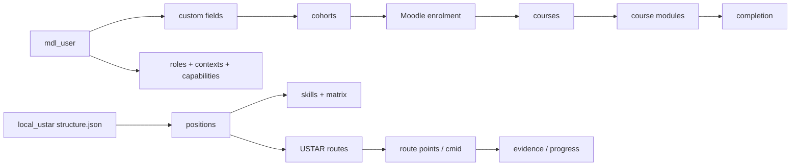

# USTAR Academy — итоговый аудит перед релизом

Дата среза: 2026-08-23 (Europe/Moscow)  
Режим: **read-only / Phase 0**  
Статус: **релиз не разрешён**  

> Все обнаруженные данные Moodle и USTAR — `CURRENT / TEST IMPLEMENTATION`. Они описывают фактическую реализацию, но не являются согласованной бизнес-моделью. `CURRENT ≠ TARGET`.

## 1. Решение по готовности

Текущую систему нельзя считать готовой к финальному релизу. Базовые сервисы работают, HTTPS настроен, cron выполняется, резервные файлы создаются, PHP-код проходит синтаксическую проверку. При этом найдены блокирующие риски безопасности, архитектуры и управляемости.

### P0 — блокеры выпуска

1. Два HR-файла доступны без авторизации из публичной директории плагина:
   - `/local/ustar/data/staff_position_map_2026-08-13.csv` — HTTP 200;
   - `/local/ustar/data/structure_staffmap_2026-08-13.json` — HTTP 200.
   Содержимое в аудит не копировалось. Требуется немедленное изъятие из web-root, проверка журналов доступа и ротация/пересборка артефактов, если они содержат персональные данные.
2. Moodle `5.1.1+` отстаёт от исправленной ветки `5.1.6`; версии 5.1–5.1.4 затронуты опубликованными уязвимостями, исправленными в 5.1.5.
3. Отдельный frontend использует Next.js `14.2.18`, устаревшую и неподдерживаемую ветку с опубликованными security advisories.
4. На исходном срезе изолированное восстановление полного комплекта не было доказано. После согласования выполнен full isolated snapshot code+moodledata+DB и независимый restore с повтором schema/login/role-boundary checks. Production-grade sealed/offsite copy, RPO/RTO и production rollback rehearsal остаются блокером выпуска.
5. TARGET Architecture Studio не подтверждён: `review.confirmed=false`; четыре object override остаются `undecided`; у TARGET model нет владельцев, источников истины и итоговых ролей; в generated-файлах нет трассировки на B001–B109.
6. Встроенная Moodle security check возвращает `CRITICAL` для default user role. Роль `user` содержит широкий системный набор, включая token/webservice и другие risky capabilities; требуется сравнение с чистым archetype и минимизация.
7. На момент исходного среза production code/config не был иммутабелен для web-процесса: `config.php` принадлежал `www-data` с mode 644; многие файлы `local_ustar`/`theme_ustar` также принадлежали `www-data`, часть имела mode 664. **P0 containment выполнен 2026-08-23 после отдельного разрешения:** config стал `root:www-data|640`, plugin/theme — `adu:adu` с directories `0755` и files `0644`; web-process read/write guard PASS. Это закрывает непосредственную writeability, но не заменяет image-based immutable deployment.

### P1 — критичные архитектурные разрывы

- `mdl_local_ustar_reporting` пуст: отсутствует фактическая цепочка руководитель → подчинённый.
- Доступ HR выдаётся всем должностям HR-отдела, включая `hrmanage`; это не разделяет HR и HRD и нарушает принцип минимальных полномочий.
- 82 из 88 активных аккаунтов не имеют явно заполненного `ustar_account_type`, но код трактует их как employee.
- Одновременно действуют Moodle enrolment и USTAR routes, включая fallback на legacy JSON. Единого назначения обучения нет.
- 52 должности объявлены в `structure.json`, 33 кода реально используются в custom field, маршрутов только 3.
- Dashboard/role journeys не выведены из TARGET: generated model содержит `roles: 0`.
- Экономика смешивает XP и USCOIN. Isolated abuse audit подтвердил idempotency race guard, но также отсутствие store/reversal, `actorid=NULL` для manual CLI и возможность отрицательного баланса; leaderboard глобально раскрывает ФИО/позиции и не реализует честные сезоны/группы.
- Игровое изображение вопроса хранится с absolute URL прежнего host и ломается при другом authenticated host; одна active game опубликована с 0 active questions. Isolated fix проверен, production unchanged.
- Кнопка завершения материала и универсальные тесты с выбором ответа не обеспечивают риск-ориентированное evidence.
- Источники истины, владельцы и lifecycle для сущностей TARGET не заполнены.
- Moodle status check сообщает ошибку `local_ai_manager_tenantcolumn_identifiers_valid`: `institution` ошибочно используется одновременно как HR-должность и AI tenant identifier; 70 active non-empty values не проходят Latin-only tenant rule. Автоматически менять кадровые поля нельзя.
- Security check сообщает `display_errors=on`, отсутствие password policy и 8 пользователей с RISK_XSS; 7 пользователей могут включать user data в backups.
- `core_publicpaths` помечен ERROR из-за пяти Caddy 308 trailing-slash redirects. Все redirect targets и все file probes дают 404; произвольные несуществующие slash-paths ведут себя так же. Прямое раскрытие не подтверждено; это health-check compatibility noise, а не P0 exposure.

## 2. История проекта и статус прежних поставок

История восстановлена по именам неизменённых release-архивов, документации пакетов, Git log, `context/`, `reports/` и текущему production. Исторический архив — evidence того, что функция проектировалась или поставлялась; он не доказывает, что функция сейчас работает на production.

| Дата/линия | Артефакт | Что добавлялось или исправлялось | Статус относительно CURRENT |
|---|---|---|---|
| 2026-08-13 | `USTAR_Academy_1.1.0_release` | Роли, структура/карьера, HR, executive, games, achievements, mobile, API/security model | Исторический baseline; не считать текущим без сверки |
| 2026-08-13 | `1.1.2_Brand_Studio_patch` | Brand Studio | Частично эволюционировало в branding JSON/UI |
| 2026-08-13 | `1.1.3_demo_release` | Демонстрационная сборка | Demo, не production acceptance |
| 2026-08-16 | `1.1.4_Demo_Final` | Финализация demo | Demo evidence |
| 2026-08-15/16 | `USTAR_UI_PROTOTYPE_v1` / UX/UI RC | Design system, 23 templates, 25 role states, 40 browser assertions | Прототип прошёл свои gates; код Moodle/БД/deploy явно не входил |
| 2026-08-15 | `1.1.5 Workspace UX hotfix` | Workspace UX fixes | Донор/исторический patch |
| 2026-08-19 | `Core Completion 1.3.0` | Content lifecycle, acknowledgement, account type, compliance, HR/control pages, tests/deploy scripts | Часть попала в production; empty account type → employee создал текущий data-governance risk |
| 2026-08-20 | `Final Product Parity 1.4.0` | Широкий API/page parity: team, HR, executive, games, checklists, route, notifications, brand | Наличие файлов не доказывает role E2E или наполненность данных |
| 2026-08-20 | `1.5.0 RC1/3/5/6` | Demo-ready итерации | Исторические кандидаты |
| 2026-08-20 | `RC7 Games Course Cover` | Игры и обложка курса | Patch evidence |
| 2026-08-20 | `RC8/8.1/8.2` | DGM runtime и JSON fixes | Patch evidence; реальный DGM role flow не протестирован |
| 2026-08-20 | `1.5.1 RC10–10.6` | Route 2.0, runtime fixes, local game images, multi-save | В production видны Route 2.0 и legacy fallback; единая модель не закрыта |
| 2026-08-20 | `RC11 Catalog` | Архобуч/catalog content | В current catalog 140 rows; бизнес-ownership не определён |
| 2026-08-20 | `RC12 Role UI Theme Cutover` | Переключение role UI/theme | Production использует `theme_ustar`; role journeys остаются не доказаны |
| 2026-08-21/22 | `local_ustar 1.5.1`, `theme_ustar 1.5.0` | Текущий production plugin/theme | Фактический CURRENT на дату аудита |

### Ранее подтверждённые исправления

- В UX/UI prototype RC устранены blocking scrim, несовпадение rail/CSS API, несколько доминирующих CTA и абсолютные пути генераторов; 30 внутренних gates PASS, 2 внешних gates были явно BLOCKED.
- Legacy cron log размером около 6.1 GB остановлен и удалён после подтверждения; вывод перенесён в journald и добавлен overlap lock.
- Bitrix callbacks были восстановлены и подтверждены операторским E2E; credential rotation оставалась отдельной несогласованной задачей.
- Создан ежедневный backup/recovery pipeline с encrypted bundle и checksums; isolated application restore не выполнялся.
- Frontend provenance исследована, но воспроизводимость всё ещё не подтверждена Git commit/OCI attestation.

### Принятые долговременные решения

- Production state выше исторических архивов (`DEC-002`).
- Локальный control center хранит проверенные факты и решения (`DEC-001`).
- Moodle остаётся activity runtime; USTAR добавляет product shell.
- `theme_ustar` — child of Boost, без наследования legacy Boost Union SCSS.
- Исторический UX/UI RC является design/prototype baseline, а не production implementation.

### Незавершённые задачи, перенесённые в этот аудит

- Стабильный owned domain вместо `nip.io`.
- Credential rotation и формальный integration inventory.
- Isolated restore и подтверждённые RPO/RTO.
- Reproducible build/deploy provenance.
- Реальные role E2E и negative permission tests.
- Единая модель org/assignment/manager/access.
- Единая модель learning assignment/route/completion/evidence.
- TARGET ownership, source of truth и B001–B109 traceability.

## 3. Проверенный production AS-IS

### Инфраструктура

| Компонент | Факт CURRENT | Оценка |
|---|---|---|
| ОС | Ubuntu, kernel 5.15.0-187 | Работает; обновление ОС отдельно не оценивалось |
| Ресурсы | 68 GB диск, 31 GB занято; 3.8 GiB RAM; swap отсутствует | Для текущей нагрузки приемлемо, но без запаса swap |
| Firewall | UFW active, default deny, публично 22/80/443 | Хорошая база |
| Reverse proxy | Caddy active/enabled | Работает |
| TLS | `academy.158-160-29-94.nip.io`, Let's Encrypt, до 2026-11-10 | Валиден |
| Основной домен | `academy.ustar.team` не резолвится и отсутствует в Caddy | Не готов |
| Tailscale Serve | `https://ustar-architecture-studio.tail5fd738.ts.net:8443` → `127.0.0.1:3100` | Доступен только tailnet |

### Контейнеры

| Сервис | CURRENT |
|---|---|
| Moodle | `moodle_web`, local `8080` |
| PostgreSQL | `moodle_postgres`, PostgreSQL 16 |
| Redis | `moodle_redis`, Redis 7 |
| USTAR frontend | `ustar_frontend`, image `1.1.5-executive-r3`, local `3000` |
| Architecture Studio | `ustar_architecture_studio`, healthy, local `3100` |
| Demo | `ustar_demo`, local `3010` |
| OSRM | `osrm-backend`, local `5000` |

### Moodle и данные

| Объект | Факт CURRENT |
|---|---:|
| Account rows / undeleted | 91 / 88 |
| Cohorts / memberships | 27 / 73 |
| Пользователи более чем в одной cohort | 0 |
| Roles / capability rows / assignments | 15 / 2622 / 75 |
| Пользователи с несколькими Moodle-ролями | 11 |
| Enrol instances / user enrolments | 28 / 45 |
| Non-site courses | 7 |
| Sections: all / non-site | 24 / 22 |
| Modules: all / non-site | 32 / 31 |
| Module completion / course completion rows | 47 / 42 |
| `local_ustar_*` tables | 23 |
| Structure departments / positions / skills | 16 / 52 / 23 |
| Используемые `ustar_position` | 33 distinct non-empty codes |
| Explicit `ustar_account_type` | 6 rows, все `employee` |
| USTAR routes / route points / route progress | 3 / 9 / 5 |
| Content / content versions / access / ack | 66 / 58 / 87 / 1 |
| Catalog / boards | 140 / 7 |
| Games / attempts / mastery | 2 / 32 / 8 |
| Check runs / answers | 2 / 10 |
| HR actions / goals / reviews | 176 / 2 / 1 |
| Reporting links | 0 |
| Installed Moodle component/version rows | 468 |

Примечание: предыдущий Studio inventory сообщал 35 sections и 34 используемые позиции. Прямой production-запрос на дату аудита дал 24 sections и 33 distinct non-empty position codes. Это не «ошибка исправления», а зафиксированный drift/scope conflict; для будущих сравнений обязательны timestamp и единое правило scope.

### Состояние выполнения

- Cron выполняется каждую минуту: 16 181 успешных task-log за 24 часа, ошибок не обнаружено.
- `local_ustar` enrolment sync работает каждые 30 минут.
- 17 задач сторонних/выключенных компонентов числятся overdue с января 2026 года и создают операционный шум.
- За последние 24 часа события `local_ustar` в Moodle event log не обнаружены: это требует проверки наблюдаемости, а не автоматически означает отсутствие использования.
- 142 PHP-файла текущего USTAR/theme прошли lint без синтаксических ошибок.
- `admin/cli/upgrade.php --is-pending` сообщает, что pending database upgrade отсутствует.
- `admin/cli/check_database_schema.php` сообщает `Database structure is ok`.
- Moodle status checks: environment/cron/task queue/schema OK; `local_ai_manager` tenant identifier ERROR; antivirus scanners не включены.
- Moodle performance checks: designer mode/cache JS/debug/DB schema OK; statistics warning.

### Plugin surface

Полный перечень 468 component/version rows сохранён в `outputs/ustar-current-state/server-export-2026-08-22/plugin_versions.csv`. Компоненты, требующие отдельного owner/security/upgrade review из-за отличия от базовой версии core или продуктовой роли:

- `local_ustar 2026082002`, `theme_ustar 2026082001`;
- `theme_boost_union 2025100643`;
- `local_ai_manager 2026071000`, `local_geniai 2026071000`, `block_ai_chat 2026050800`, `tiny_ai 2026050500`;
- `local_intelliboard`, `block_rbreport`, `block_xp`;
- `local_cohortrole`, `local_lumination`, `local_preventcopy`;
- `filter_filtercodes`, `mod_customcert`, `mod_pulse`, `mod_rumbletalkchat`, `tiny_premium`;
- `tool_mulib`, `tool_murelation`.

Это inventory для review, а не утверждение, что каждый компонент уязвим или нужен TARGET. У каждого должен появиться owner, purpose, data access, current use, upgrade source, license и remove/keep decision. Семнадцать overdue scheduled tasks и текущая ошибка `local_ai_manager` показывают, что plugin lifecycle сейчас не закрыт.

### Frontend/build/assets

- Running image: `ustar_frontend:1.1.5-executive-r3`, digest начинается `sha256:6d4f15…`; mounts отсутствуют.
- Package: Next.js 14.2.18, React 18.3.1; обнаружено 21 workspace route плюс API routes.
- Static assets running image: около 1.3 MB; source hash non-`node_modules` files начинается `68b448…`.
- Локальный donor snapshot совпадает с inspected package по ключевым файлам, но Git commit/OCI attestation отсутствует: build не считается воспроизводимым.
- За последние 24 часа в container logs не обнаружены `error`, `warn`, `404`, `500`; это smoke evidence, а не client-side E2E.
- Frontend CSS содержит несколько исторических visual layers/tokens; `page.tsx` и global stylesheet смешивают product components и presentation hotfixes.
- Moodle theme source использует отдельные `_tokens.scss`, `_foundation.scss` и component partials; layout содержит inline SVG registry. Тема синтаксически корректна, но login layout не переопределён.
- 29 новых 3D PNG-иконок проверены; 12 semantically valid assets собраны в strict feature-icon registry и проверены только в isolated environment. Production manifest/deployment отсутствует; license/provenance и оптимизация веса остаются gate.

## 4. Sources of truth — фактическое состояние

Это две параллельные цепочки. Ни одна не признана TARGET source of truth. Moodle role не равна должности, cohort не равна отделу или должности, enrolment не равен маршруту.

## 5. Architecture Studio

Canonical state на сервере:

- `/opt/ustar/state/architecture-studio/target-decisions.json`;
- 30 решений помечены `resolved`;
- 60 entity overrides: 56 resolved, 4 undecided;
- undecided: `person:87`, `account-type:2`, `position:ceo`, `access-profile:12`;
- `review.confirmed=false`;
- generated revision: 929;
- generated TARGET: 28 entities, 60 overrides, 0 ролей;
- поля owner и sourceOfTruth не заполнены;
- ссылки на Конституцию B001–B109 отсутствуют.

Вывод: интерфейс Studio и сохранение решений технически работают, но результат является черновиком интервью, а не принятой эталонной архитектурой.

## 6. Security review

| Риск | Severity | Доказательство | Требуемое действие |
|---|---|---|---|
| Публичные HR mapping files | P0 | HTTP 200 без сессии | Убрать из web-root; проверить access logs; data incident review |
| Default authenticated role | P0 | Moodle `core_defaultuserrole` CRITICAL; risky capabilities в system context | Сравнить с clean archetype, удалить лишнее, negative tests |
| Writable production code/config | P0 | `config.php` и многие plugin/theme files owner `www-data`; часть 664 | Read-only image/code ownership; secrets/config вне write path |
| Moodle 5.1.1+ | P0 | Текущая версия и официальные advisories | Обновить в тестовой среде минимум до актуальной 5.1.x |
| Next.js 14.2.18 | P0 | package/image inspection и advisories | Мигрировать на поддерживаемую исправленную ветку |
| Token в signed, но не encrypted cookie | P1 | Frontend source review | Серверная сессия или шифрование/короткий TTL/rotation |
| Token в file URL query | P1 | `moodleFileUrl` | Проксировать download; не помещать token в URL |
| `bx_grade_tokens.txt` mode 666 | P1 | File permission review | Снизить права и проверить владельца/rotation |
| HR capability escalation | P1 | `position_access` | Разделить HR/HRD и применять least privilege |
| External service без explicit users | P1 | Moodle service config | Ограничить users/functions/IP и провести token inventory |
| Upload без явного allowlist в frontend | P2 | Frontend source | MIME/extension/signature policy и malware scanning |
| Global leaderboard disclosure | P1 | Economy implementation | Scope по доступу, privacy rules, seasons |
| PHP errors/password policy | P1 | Moodle security check warnings | `display_errors=off`, password/MFA policy согласно threat model |
| AI tenant configuration | P1 | `institution` содержит HR-должности, но используется как Latin-only AI tenant; 70 active values invalid | Выбрать single default, dedicated tenant mapping или удалить неутверждённый AI component; не менять HR data |
| Public-path configuration | P2 check-noise | Five directory probes 308→404; every file and redirect target 404; arbitrary slash paths behave identically | Optional Caddy pre-normalisation 404 rule after isolated rehearsal |
| Antivirus/upload scanning | P2/P1 by data class | Moodle status `NA`, frontend upload policy incomplete | Ввести scanner/allowlist согласно содержимому |

Секреты, токены и персональные данные в этот отчёт не включались.

## 7. Главные конфликты CURRENT

1. Role ≠ Position ≠ Access Profile.
2. Cohort ≠ Department ≠ Position, хотя cohort используется для назначения курсов.
3. 52 declared positions ≠ 33 used positions ≠ 3 routes.
4. 91 account rows ≠ 88 active people ≠ 6 explicit account types.
5. Moodle enrolment и USTAR route одновременно назначают обучение.
6. Moodle completion и USTAR progress/evidence одновременно описывают прогресс.
7. `structure.json`, custom field и staff mapping параллельно описывают организацию.
8. HR/manager/CEO интерфейсы существуют фрагментарно, но reporting hierarchy пуста.
9. XP/USCOIN/leaderboard не соответствуют полной модели сезонов и справедливого сравнения.
10. CURRENT content не имеет полного ownership/source-of-truth/version-governance.

## 8. Release gates

До ветки релиза и любых production-изменений должны быть явно подтверждены:

- [ ] Владелец принимает этот аудит и `ARCHITECTURE_DIFF.md`.
- [ ] Публичные HR-файлы локализованы и обработаны как security incident.
- [ ] TARGET Studio синхронизирован с B001–B109, review подтверждён.
- [ ] Для каждой TARGET-сущности назначены owner, source of truth и lifecycle.
- [ ] Выполнен isolated restore DB + moodledata + code/image; зафиксированы RTO/RPO.
- [ ] Определена безопасная тестовая среда и rollback.
- [ ] Выполнены реальные role scenarios employee / manager / HR / HRD / CEO.
- [ ] Принято решение по единому auth/session/download-token механизму.
- [ ] Принято решение Moodle enrolment vs USTAR route и completion vs evidence.
- [ ] Подтверждён migration/upgrade path Moodle и Next.js.

## 9. Что не делалось

- Production, БД, роли, пользователи, маршруты, theme, Moodle и Docker не изменялись.
- Новые аккаунты и токены не создавались.
- Авторизованные сценарии ролей не выполнялись: безопасные тестовые учётные данные не предоставлены.
- Backup restore не запускался на production.
- Git-ветка релиза не создавалась, checklist skill не устанавливался: оба действия относятся к фазе после согласования аудита.

## 10. Evidence

- Production read-only SSH и SQL, 2026-08-22/23.
- `outputs/ustar-current-state/` и `server-export-2026-08-22/`.
- Canonical Architecture Studio state и generated revision 929.
- Репозиторий `C:\Users\User\Desktop\release\Ustar-control` и read-only snapshot 2026-08-19.
- `USTAR_ACADEMY_CONSTITUTION_v1.0.json`, version 1.0.0, 109 approved rules.
- Canva design `DAHTBqJuKtA`, «Страница логина Устар».
- Официальный [Moodle release calendar](https://moodledev.io/general/releases): 5.1.6 опубликован 2026-08-10, ветка 5.1 поддерживается по security до 2027-04-19.
- Официальные [Moodle security announcements](https://moodle.org/security/index.php?o=3&p=1): 5.1–5.1.4 перечислены среди affected, исправления выпущены в 5.1.5.
- Официальный [Next.js Security Update от 2025-12-11](https://nextjs.org/blog/security-update-2025-12-11): для 14.x исправленная версия указана как 14.2.35; current 14.2.18 ниже неё.
- Официальный [Next.js release/security blog](https://nextjs.org/blog): на дату аудита поддерживаемые security targets включают 16.2.11 Active LTS и 15.5.21 Maintenance LTS. Конкретная migration target должна быть выбрана после compatibility test.
