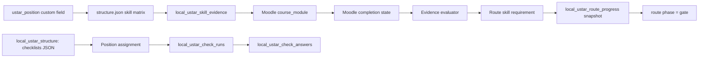
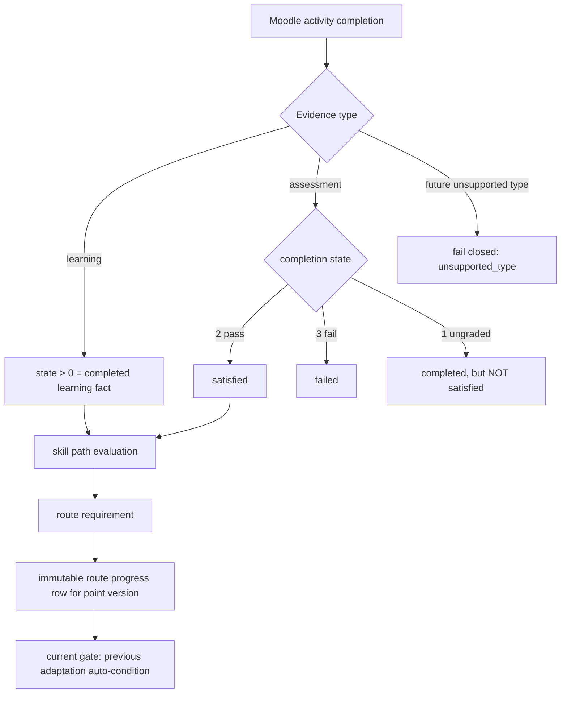
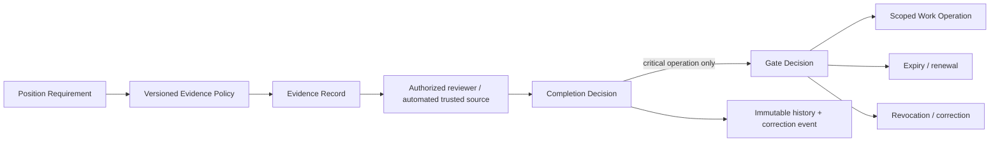

# Evidence → Checklists → Gate — CURRENT runtime audit

Дата: 2026-08-23

Среда проверки: isolated Moodle `http://127.0.0.1:18080`

Статус данных: **CURRENT / TEST IMPLEMENTATION; CURRENT ≠ TARGET**

Production: **не изменялся**

## 1. Результат

Текущий контур действительно содержит три технических механизма, но пока не образует согласованный бизнесовый lifecycle допуска:

1. `local_ustar_skill_evidence` связывает 3 навыка с 12 Moodle activities.
2. Checklists хранят 2 JSON-определения и 2 перезаписываемых дневных исполнения.
3. Route 2.0 содержит 1 опубликованную точку `gate`, которая автоматически закрывается условием `previous_adaptation`.

Isolated audit подтвердил и закрыл три fail-closed дефекта:

- Moodle assessment state `1` («complete, pass/fail не доказан») больше не удовлетворяет Evidence;
- зарезервированные, но не реализованные типы `practice`, `manager_review`, `checklist`, `certification` больше не засчитываются как обычное Moodle completion и убраны из формы создания;
- Checklist Studio теперь отклоняет повторяющиеся/пустые item ID, пустые item title, неверную вложенную структуру и stale catalog version.

Это техническое containment. Оно **не утверждает**, какие Evidence, Checklists или Gates нужны бизнесу.

## 2. Конституционный ориентир

| Правило | Обязательный смысл | CURRENT |
|---|---|---|
| B012 | Навык — способность, а не отметка о прохождении | Moodle completion используется как технический факт; competency decision отсутствует |
| B026 | У шага заранее определено условие; открытие не достаточно, если нужно доказательство | Route поддерживает course/cm/content/skill/previous requirements, но `content:open` допустим и требует risk policy |
| B029–B034 | Независимые дневные/финальные листы сотрудника и руководителя, issue → action, три исхода адаптации | Есть общий пользовательский daily checklist; зеркальная пара, срок, issue/action и final outcome отсутствуют |
| B035 | Специальный допуск только для критической операции | Gate реализован универсальной route phase без critical-operation entity |
| B038–B040 | Expiry только по необходимости; критическая просрочка закрывает связанную операцию; ступенчатые напоминания | `validdays/expiresat` технически есть, но текущий gate бессрочный; operation scope и reminders отсутствуют |
| B043–B045 | Карточка навыка описывает способ подтверждения; evidence соответствует риску | CURRENT имеет только `learning` и `assessment`; 9/3 definitions |
| B046 | Попытки зависят от важности, повторный провал запускает помощь | Moodle attempts есть как runtime, но policy/help/escalation USTAR отсутствуют |
| B067–B068 | Детальная история и исправления не переписываются молча | Route progress хранит snapshot; checklist answers при повторной отправке удаляются и заменяются |

## 3. Фактический inventory

### Evidence

| Факт | Количество |
|---|---:|
| `mdl_local_ustar_skill_evidence` | 12 |
| distinct skills | 3 |
| position-scoped | 12 |
| shared | 0 |
| required | 12 |
| `learning` | 9 |
| `assessment` | 3 |
| activity source | 12 |
| source integrity OK | 12 |
| SCORM / quiz / page modules | 6 / 4 / 2 |
| expiring / indefinite definitions | 5 / 7 |

Три assessment definitions ссылаются на quiz. Среди learning definitions: 6 SCORM, 2 page и 1 quiz. Технические mapping источники существуют и course/cmid mismatch не найден.

### Checklists

| Факт | Количество |
|---|---:|
| JSON definitions | 2 |
| active | 2 |
| recurrence `daily` | 2 |
| position assignments | 3 |
| sections | 5 |
| definition items | 27 |
| execution rows | 2 |
| answer rows | 10 |
| duplicate answer keys / orphan answers | 0 / 0 |

Execution schema не хранит definition version, immutable revision или correction link. Повторная отправка одного user/checklist/date обновляет run, удаляет старые answers и вставляет новые. Поэтому нынешние 10 answers нельзя использовать как доказательство неизменяемой истории B067–B068.

### Route / Gate

| Факт | Количество |
|---|---:|
| routes | 3 |
| points | 9 |
| adaptation / gate / continuous | 4 / 1 / 4 |
| route versions | 9 |
| published / draft | 5 / 4 |
| progress snapshots | 5 |
| progress mode `evaluated` | 5 |
| system-recorded | 5 |
| progress with expiry | 0 |

Единственный опубликованный gate имеет одно условие: `previous_adaptation`. Он не имеет reviewer, отдельного decision record, critical operation, срока или revocation lifecycle. Таблицы `local_ustar_gate_decisions` и `local_ustar_gate_revocations` отсутствуют.

## 4. CURRENT source map



## 5. Как CURRENT принимает решение



Изменённые ветви `state 1` и unsupported types — только isolated candidate. Production по-прежнему выполняет прежнюю логику.

## 6. TARGET-модель — только placeholder для решения владельца



Эта схема не является утверждённым TARGET. Нужны решения о risk classes, reviewer authority, expiry, revocation, operation scope и источнике истины.

## 7. Isolated before/after proof

| Boundary | Old isolated | Guarded candidate |
|---|---|---|
| assessment completion state `1` | `satisfied=true` | `satisfied=false`, `completed_ungraded` |
| assessment state `2` | pass | pass |
| assessment state `3` | fail | fail |
| fake `manager_review` mapped to Moodle activity | `completed`, `satisfied=true` | `unsupported_type`, `satisfied=false` |
| course-level assessment | generic course progress | `unsupported_source` |
| duplicate checklist item ID | accepted | rejected |
| stale checklist catalog version | accepted | rejected |
| employee HR publish | denied | denied |
| employee unassigned checklist submit | denied | denied |

Probe cleanup after every run restored exactly:

```text
skill_evidence=12
check_runs=2
check_answers=10
route_progress=5
checklist_structure_version=1
checklist_structure_sha256=1415da270eb493575034a916ecc2f904595aa8d6d164f9653911b0dd6b5c21ca
```

## 8. Rollback and technical verification

- Roundtrip: candidate → old → candidate: **PASS**.
- Both old and guarded semantics reproduced after the corresponding file set was installed.
- Backup: `/opt/ustar/test-env/ustar-final-audit-release/release-backups/evidence-checklist-gate-before-2026-08-23_14-54-19`.
- Backup `SHA256SUMS`: 4/4 **PASS**.
- PHP lint: 4/4 files **PASS** on every roundtrip stage.
- Final local review files and isolated hashes: exact match.
- Final runtime boundary + ACL probe: **PASS**.
- Login loopback HTTP check: **PASS**.
- Recent isolated log scan: no PHP fatal, parse error or uncaught exception from this block.

Final isolated hashes:

```text
0be84cc134bcdbfe98797d8991ffd8f43d106fff34a97594ea4306a2106b9f3f  classes/evidence.php
33ff8755495f597d0593f705d22439a233256b281e24429fc3b4124c549d8f8a  classes/position_model.php
b38219217bd88c48126529c1b13e7c4555943ca22f3abea9d65a8a6be3e6c3e0  classes/external/hr_save_checklists.php
5f6aed0d604f4e7fee712196219c225b137c088a32674405905f61a579a9b52d  positions.php
```

## 9. Открытые конфликты / owner decisions

1. Какие должности и операции действительно требуют специального Gate по B035?
2. Какие Evidence classes утверждаются: studied, knowledge test, practice, supervised practice, certification?
3. Кто может подтверждать практику и принимать Gate Decision; где действует organisational scope?
4. Какие confirmations истекают и какие операции блокируются при expiry?
5. Как оформляются revoke/correction без переписывания исходной истории?
6. Нужны ли зеркальные daily checklists сотрудника/руководителя по B029–B034 или CURRENT operational checklists остаются отдельной сущностью?
7. Как versioned checklist definition связывается с immutable execution snapshot?
8. Что запускает manager help после повторных failure по B046?

До этих решений Current Gate нельзя считать эталонным допуском, а текущие checklist executions — кадровым доказательством.

## 10. Артефакты

- Runtime probe: `ops/evidence_checklist_gate_runtime_probe.php`.
- Isolated deploy/rollback verifier: `ops/deploy_evidence_checklist_guard_isolated.sh`.
- Guarded review sources: `local_ustar/classes/evidence.php`, `local_ustar/classes/position_model.php`, `local_ustar/classes/external/hr_save_checklists.php`, `local_ustar/positions.php`.
