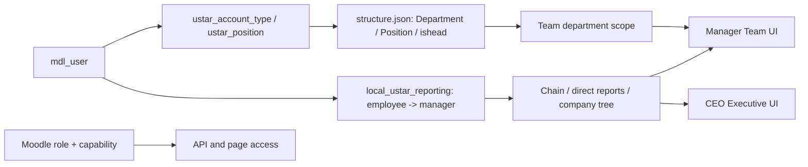

# USTAR Organization / Reporting / Team — CURRENT runtime audit

Дата: 2026-08-23

Среда: isolated Moodle `http://127.0.0.1:18080` через временный локальный SSH tunnel

Статус: **CURRENT / TEST IMPLEMENTATION; CURRENT != TARGET**

Production: **не изменён; production release не разрешён**

## 1. Что проверено

Проверен фактический путь данных и доступа:



Проверка привязана к B011, B066, B092–B103 и B109. CURRENT не реализует B096 в полном виде: штатная единица, вакансия, временное назначение, период действия и версионируемая manager relation отсутствуют.

## 2. Обезличенный inventory

| Факт | Значение | Provenance |
|---|---:|---|
| CURRENT master inventory | 91 account row / 88 undeleted | canonical current-state inventory |
| Departments declared | 16 | `local_ustar_structure.structure.json` |
| Positions declared | 52 | `local_ustar_structure.structure.json` |
| Reporting table exists | yes | Moodle DB schema |
| Reporting rows | 0 | isolated restored CURRENT DB |
| Distinct managers | 0 | isolated restored CURRENT DB |
| Isolated active non-site accounts | 91 | includes synthetic audit fixtures; not a production staffing number |
| Isolated participating accounts | 90 before the temporary account-type boundary test | `accounts::participates`; includes synthetic fixtures |

The runtime probe emitted only counts, booleans, technical scenario labels and scopes. It did not emit names, emails, message text or raw identifiers.

## 3. Confirmed CURRENT defects

| ID | CURRENT behavior | Risk | Candidate containment |
|---|---|---|---|
| ORG-01 | `reporting_available()` meant only “table exists”. With 0 rows the Team/Executive UI suppressed the “not configured” warning. | A flat people list was presented as an organizational hierarchy. | Added `reporting_configured()` requiring at least one valid participating employee→manager line; UI uses this truth signal. |
| ORG-02 | `get_team` trusted `position.ishead` and did not enforce `local/ustar:viewteam`. Synthetic HR without the capability received a department payload. | Position/custom field acted as an access grant; Role ≠ Position invariant was violated. | API now requires the explicit Moodle capability. HR without it is denied; CEO remains allowed because CEO currently has the capability. |
| ORG-03 | Test/service accounts with a mapped position appeared in manager/company team metrics. | Workforce progress and headcount could include non-workforce accounts. | `get_team` now applies the existing `accounts::participates()` boundary. |
| ORG-04 | `org::set_manager()` accepted a nonexistent manager ID. | Dangling reporting lines and misleading trees were possible through direct callers. | Employee and manager IDs must reference undeleted Moodle users; self/cycle guards remain. |

## 4. Before / after runtime evidence

| Scenario | CURRENT before | Guarded candidate |
|---|---|---|
| Table exists, rows = 0 | “configured” implicitly; warning hidden | `reporting_configured=false`; warning shown |
| Valid synthetic relation | manager resolved, chain depth 2, direct report visible | same; `reporting_configured=true` while the row exists |
| Cycle / self manager | rejected / rejected | rejected / rejected |
| Nonexistent manager | accepted | rejected |
| Employee Team API | denied | denied |
| Retail manager Team API | allowed, department scope, 1 non-participating fixture visible | allowed, department scope, 0 non-participating fixtures |
| HR Team API, no `viewteam` capability | allowed through `ishead` | denied |
| CEO Team API | allowed | allowed because current CEO role explicitly has `viewteam` |
| CEO Executive API | allowed | allowed because current CEO role explicitly has `executive` |

Every probe run restored the exact baseline:

```text
reporting_rows = 0 -> 0
reporting_fingerprint = 4f53cda1...b945 -> identical
audit_employee account type = employee -> employee
```

Rollback round-trip:

```text
candidate -> exact CURRENT -> candidate
CURRENT unsafe semantics reproduced: PASS
guarded semantics reapplied: PASS
ORGANIZATION_REPORTING_GUARD_ROLLBACK_ROUNDTRIP=PASS
```

Durable isolated rollback copy:

```text
/opt/ustar/test-env/ustar-final-audit-release/release-backups/organization-reporting-before-2026-08-23_15-33-27
```

Its explicit five-file `MANIFEST.sha256` verifies `5/5 OK`. It is a test-environment rollback set, not a production backup.

## 5. Browser evidence

- CEO page: warning count `1`, rendered flat org nodes `0`.
- Manager Team page: reporting-not-imported warning count `1`.
- Synthetic web sessions revoked after validation: `sessions_before=1`, `sessions_after=0`.
- Temporary tunnel closed.
- Evidence files contain aggregate/synthetic UI only; the manager image is cropped to the warning and contains no real employee names.

Evidence:

- `evidence/organization-reporting/ceo_reporting_not_configured.png`
- `evidence/organization-reporting/manager_reporting_not_configured.png`

## 6. Deliberately not changed

The candidate does **not** decide the following TARGET questions:

1. Does a manager’s Team mean direct reports, the whole department, named responsibility scope or a combination?
2. Is CEO allowed employee-level detail by default or only drill-down on a documented reason?
3. What system is canonical for staff places, assignments and time-bounded manager relations?
4. Who approves org changes, vacancy fallback and temporary acting assignments?
5. How are multiple assignments represented without overwriting the primary position?

CURRENT `get_team` still uses department scope for a head and company scope for superadmin. `org::direct_reports()` uses explicit reporting rows. These parallel meanings are documented as a conflict, not silently merged.

## 7. Files in the review candidate

- `moodle/local/ustar/classes/org.php`
- `moodle/local/ustar/classes/external/get_team.php`
- `moodle/local/ustar/team.php`
- `moodle/local/ustar/executive.php`
- `moodle/local/ustar/templates/executive.mustache`
- `release/ustar-final-audit-release/ops/organization_reporting_runtime_probe.php`
- `release/ustar-final-audit-release/ops/deploy_organization_reporting_guard_isolated.sh`
- `release/ustar-final-audit-release/ops/verify_organization_reporting_guard_roundtrip.sh`

The bundle mirrors the five runtime files under `release/ustar-final-audit-release/local_ustar/`. No deployment script in the bundle authorizes production.
